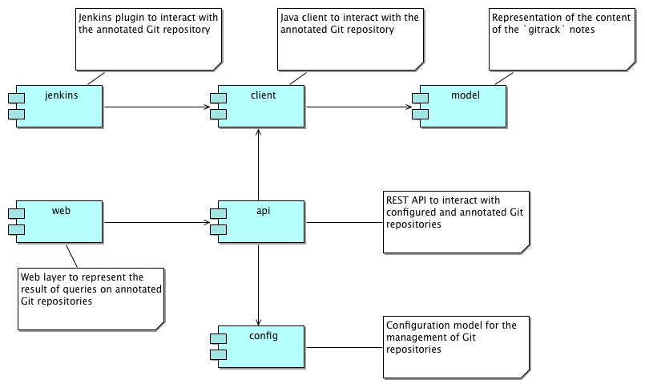

gitrack
=======

## Implementation concepts

Any traceability, build numbers, versions, promotions, validations, etc., is stored in a [Git Note](https://www.kernel.org/pub/software/scm/git/docs/git-notes.html), stored at _commit_ level in the `gitrack` namespace.

The format of the note is a YAML content, like:

```YAML
validation-stamps:
   CI:
      timestamp: ...
      user: jenkins
      status: PASSED
promotions:
   COPPER:
      timestamp: ...
      user: jenkins
```

Such a content is created:

* manually, using the `git` commands
* through your CI engine, like Jenkins

`gitrack` provides libraries to facilitate the interaction with the content of the `gitrack` namespace.

The same `gitrack` libraries provide also tools to read and query on the content of those notes.

> Those libraries work in a standalone way and do not need to access any particular server.

Finally, there is also a `gitrack` Spring Boot application, which can be deployed on a server or run locally, to display graphs and queries on an annotated Git repository.

For example, we can display a commit graph where commits are filtered according to some criteria and are decorated according to the content of the notes.

## Architecture overview



## Integration with Ontrack

A `gitrack` project can be seen as a specific class of project in `ontrack`, with its own specific views and interaction model.

Having such an integration allows to benefit from existing Ontrack features: Git repository management, etc.

Having a specific class of project is not possible yet in Ontrack and such an extension point has to be developed first.

## Architecture guidelines

## Modules

### Config

### Model

### Client

### API

### Web

### Jenkins

## History

The [Ontrack](https://github.com/nemerosa/ontrack) is born in order to allow to add traceability in the continuous pipelines of many projects and branches:

* branches
* builds and commits
* tracking of validations and promotions
* change logs between builds

Born with Subversion, it was then adapted to Git, but didn't really take advantage of this SCM.

_Gitrack_ is a conceptual fork of _Ontrack_ where we start to take full advantage of the capabilities of Git, leading to more flexibility and simplicity.
